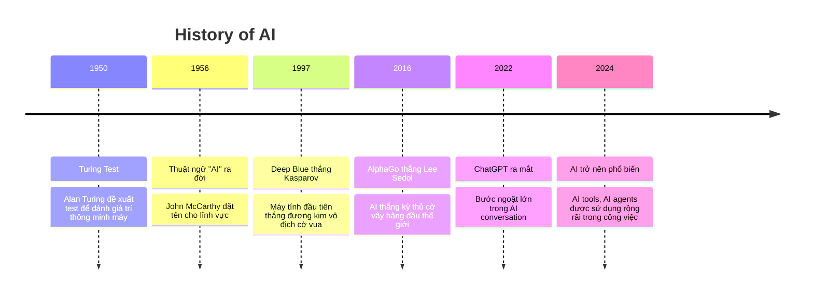

Huyền thoại về “10x engineer” – lập trình viên làm việc hiệu quả gấp 10 lần người thường – đã tồn tại hàng thập kỷ, tôi tin chắc đó là một mục tiêu, một danh xưng mà bất cứ lập trình viên nào cũng muốn đạt được. Tôi từng tin rằng để trở thành “10x engineer” bạn phải là thiên tài: code 1000 dòng/ngày, fix bug thần tốc, biết đủ thứ từ backend, frontend đến DevOps, biết sử dụng nhiều tool, lả lướt trên bàn phím bằng phím tắt, thậm chí tôi từng nghĩ rằng 10x engineer là mấy nhân vật huyền thoại trong thung lũng Silicon – những người một mình cân cả team. Nhưng kể từ khoảnh khắc ChatGPT được open (**ChatGPT moment**), định nghĩa này đã thay đổi hoàn toàn.

> Vậy làm thế nào để trở thành 10x Engineer trong thời đại bùng nổ AI như hiện nay?

Câu trả lời là **tôi không biết**. Tôi đặt title vậy cho hấp dẫn thôi 😃.

Trong bài viết này, tôi sẽ nói về cách để trở nên năng suất trong công việc lập trình và các task trong cuộc sống bằng cách tận dụng AI, bài viết được chia sẻ dưới góc nhìn và trải nghiệm của một Software Engineer đã học tập và làm việc trước khi AI trở nên phồ biến và so với bây giờ thì công việc của tôi đã thay đổi như thế nào nhé.

## I. ChatGPT – một dấu mốc rõ ràng cho một cuộc cách mạng

Tất nhiên, AI không phải hôm qua mới có. Nó đã âm thầm phát triển từ những năm 50, từ cái Turing Test xa xưa cho đến khi AlphaGo hạ gục Lee Sedol. bạn có thể xem qua timeline các mốc thời gian kèm các sự kiện đáng chú ý dưới đây

| Năm          | Sự Kiện Chính                                           | Mô Tả Ngắn Gọn                                                                                                                     |
| ------------ | ------------------------------------------------------- | ---------------------------------------------------------------------------------------------------------------------------------- |
| 1950         | Alan Turing đề xuất Turing Test                         | Turing xuất bản bài báo "Computing Machinery and Intelligence", đặt nền tảng cho khái niệm máy móc có thể "nghĩ" như con người.    |
| 1951         | SNARC - Mạng nơ-ron nhân tạo đầu tiên                   | Marvin Minsky và Dean Edmonds xây dựng mạng nơ-ron đầu tiên sử dụng ống chân không để mô phỏng nơ-ron.                             |
| 1956         | Hội nghị Dartmouth - Sinh ra thuật ngữ "AI"             | John McCarthy tổ chức hội nghị, đánh dấu sự ra đời của lĩnh vực AI, với niềm tin máy móc có thể mô phỏng trí thông minh con người. |
| 1958         | Perceptron - Mạng nơ-ron đầu tiên                       | Frank Rosenblatt phát triển Perceptron, mạng nơ-ron có thể học từ dữ liệu, nền tảng cho học máy hiện đại.                          |
| 1960         | ADALINE - Mạng nơ-ron tuyến tính                        | Bernard Widrow và Ted Hoff phát triển ADALINE, nền tảng cho tiến bộ trong học máy.                                                 |
| 1966         | ELIZA - Chatbot đầu tiên; Shakey the Robot              | Joseph Weizenbaum tạo ELIZA, chatbot mô phỏng nhà trị liệu; Shakey là robot di động thông minh đầu tiên.                           |
| 1969         | Sách "Perceptrons" và giới hạn của mạng nơ-ron đơn giản | Marvin Minsky và Seymour Papert chỉ ra hạn chế, dẫn đến giảm nghiên cứu mạng nơ-ron.                                               |
| 1973-1980    | "Mùa đông AI" đầu tiên                                  | Báo cáo Lighthill dẫn đến cắt giảm tài trợ, làm chậm tiến bộ AI.                                                                   |
| 1986         | Xe tự lái đầu tiên                                      | Ernst Dickmanns phát triển xe Mercedes có thể lái trên đường trống.                                                                |
| 1987-1994    | "Mùa đông AI" thứ hai                                   | Giảm tài trợ và kỳ vọng, dù có tiến bộ như hệ thống chuyên gia.                                                                    |
| 1997         | Deep Blue đánh bại Garry Kasparov                       | IBM's Deep Blue thắng nhà vô địch cờ vua, chứng minh AI có thể xử lý tính toán phức tạp.                                           |
| 2011         | IBM Watson thắng Jeopardy; Siri ra mắt                  | Watson xử lý ngôn ngữ tự nhiên; Apple giới thiệu trợ lý ảo Siri.                                                                   |
| 2012         | AlexNet thắng ImageNet                                  | Mạng nơ-ron sâu của Geoffrey Hinton đánh dấu sự bùng nổ học sâu trong nhận diện hình ảnh.                                          |
| 2016         | AlphaGo đánh bại Lee Sedol                              | DeepMind's AlphaGo thắng cao thủ cờ vây, sử dụng học tăng cường.                                                                   |
| 2020         | GPT-3 ra mắt                                            | OpenAI phát hành mô hình ngôn ngữ lớn, tạo văn bản giống con người.                                                                |
| 2022         | ChatGPT được phát hành                                  | OpenAI's ChatGPT cách mạng hóa giao tiếp AI, dựa trên GPT-3.                                                                       |
| 2023         | Bùng nổ AI tạo sinh                                     | GPT-4, Bing Chat, Google Bard ra mắt, mở rộng ứng dụng AI.                                                                         |
| 2024 đến nay | Tiến bộ liên tục và lo ngại đạo đức                     | AI phát triển nhanh, với các cuộc thảo luận về quy định và tác động xã hội (dựa trên xu hướng gần đây).                            |

Rõ ràng có thể thấy, AI đã có từ lâu rồi, vậy tại sao tới khoảng vài năm trở lại đây chúng ta mới bắt đầu thấy từ ngữ AI tràn ngập khắp mọi nơi? Tôi nghĩ câu trả lời nằm ở **tính đột phá** và **khả năng dễ dàng tiếp cập**. AI không còn là vũ khí bí mật được độc quyền bởi chính phủ, công ty lớn, cũng không phải cần trình độ cao siêu để hiểu và sử dụng, bây giờ, với ChatGPT nó đã hiện diện ở khắp mọi nơi, là thực hiện được những điều không tưởng và với chi phí gần như bằng không.

Cái hay là: ChatGPT biến AI thành **công cụ phổ thông**. Nó không còn là thứ xa vời trong phòng lab nữa, mà nằm ngay trong điện thoại, trong quán cà phê, trong văn phòng và mọi người đang quen với việc sử dụng nó như công nghệ tìm kiếm google ngày trước vậy.

Với dân lập trình chúng ta, điều này mở ra một chân trời mới: **code không chỉ viết bằng tay, mà còn được viết bằng prompt.**

## II. Nhưng chỉ biết ChatGPT thôi là chưa đủ

Đúng, ChatGPT rất mạnh. Nhưng nếu bạn nghĩ làm dev thời nay chỉ cần biết mỗi ChatGPT, thì… chưa đủ.

Nếu có theo dõi về tin tức, bạn sẽ thấy, các mô hình ngôn ngữ lớn thi nhau ra: ChatGPT, Gemini, Grok, DeepSeek... các bài báo ứng dụng LLM cũng nhiều vô số kể, **công cụ AI cho dev giờ nhiều như một cái chợ**: Cursor, Claude code, Gemini-cli, Codex (OpenAI), Loveable, Google Stitch… chúng thật sự rất tuyệt vời. Nhưng nếu chỉ dừng ở mức “nghe tên” hoặc “xem review trên mạng”, thì bạn mới ở tầng ngoài.

Cái quan trọng là **phải thực sự dùng**. Trải nghiệm, mày mò và khai phá. Và tất nhiên, cái giá $20/tháng cho mỗi tool cũng là rào cản khá đau ví tiền 😅. Nhưng hãy coi nó là đầu tư nghề nghiệp – giống như ngày xưa bạn bỏ tiền mua sách đi học thì bây giờ bạn mua đồ nghề, công cụ đi làm thôi.

Thú thật, tôi cũng chỉ mới thực sự khai phá Cursor và Claude trong vòng 3 tháng trở lại đây (may mắn là tôi được client tài trợ mấy tháng đầu để vượt qua cái suy nghĩ rào cản trả phí ban đầu). Nghe thì muộn, nhưng hóa ra lại đúng thời điểm, bởi khái niệm **Vibe Coding** cũng mới trở nên phổ biến đâu đó từ đầu năm nay.

## III. Vibe Coding – khi code không còn khô khan

Ngày xưa, viết code là mở IDE, mở hàng chục tab chrome để tìm kiếm thông tin, gõ từng dòng, test, debug, chửi thề rồi uống cà phê.

Giờ thì vibe coding là… **ngồi trò chuyện với AI, vừa nghe nhạc vừa code, như đang ra lệnh với một nhân viên cấp dưới vậy**.

- Bạn vứt ý tưởng cho Claude, nó biến thành một cái backlog có đủ epic và user story.

- Bạn nhờ Cursor viết nhanh một service nhỏ, nó quăng lại code chạy được luôn.

- Bạn kẹt bug, mở ChatGPT ra “giải ngố”.

- Cần so sánh library A với B? Hỏi Grok, nó phân tích như một bài review chi tiết.

Code bỗng trở nên **nhẹ nhàng, tự nhiên**, không còn cảnh cặm cụi cả ngày để mở hàng chục tab google để viết được vài chục dòng code.

*Tuy nhiên nó cũng không màu hồng lắm đâu, phải trong chăn mới biết chăn có rận, phải vibe code thì mới biết vibe code cũng là một kỹ năng*

## IV. My AI Stack

Với vai trò solo developer/freelancer, tôi dần hình thành một **flow AI** riêng, kiểu AI tool stacks:

1. **ChatGPT** → chuyên trị giải thích lỗi, clarify kiến thức, tóm tắt docs.

2. **Grok** → phân tích, tìm kiếm, so sánh, kiểu “Google search nhưng có não”.

3. **Cursor** → code nhanh mấy chức năng đơn giản, file nhỏ.

4. **Claude** → chiến big feature. Tôi feed cho nó prompt chi tiết, truyền context repo, và để nó đề xuất kiến trúc khi tôi đồng ý thì mới để nó generate từng phần.

5. **Bolt.new** → dựng nhanh phần FE ban đầu đầu.

Tôi biết ngoài kia còn nhiều tools hay ho khác nữa, nhưng với tài chính hiện tại chỉ có thể trả phí cho Cursor và Claude, bộ AI tool stasks trên vẫn đang ổn áp và đáp ứng đủ nhu cầu của tôi.

### Best practices tôi rút ra

- **Prompt chi tiết là chìa khóa**: đừng lười, AI nó không biết đọc suy nghĩ của bạn đâu, bạn không cần thiết phải follow theo mấy prompt template cứng nhắc mà mấy khứa KOL trên facebook share đâu, LLM hoàn toàn có thể hiểu bạn miễn là bạn viết đủ ý. Viết prompt rõ ràng, có context, có ví dụ → kết quả ngon hơn nhiều. Cùng 1 vấn đề, cùng 1 model thì prompt và context chính là 2 thứ quyết định AI có thực hiện được nhiệm vụ của bạn đề ra hay không, nhưng nếu đã thử khoảng 5-7 lần mà nó vẫn không thể hiểu hoặc hiểu nhưng làm sai thì đó là lúc bạn cần đổi model đổi AI Agent khác xem thử. Ví dụ như có lần tôi cần chỉnh sửa 1 chức năng UI trên desktop app, tôi khá tự tin là cursor sẽ làm được vì đây là 1 vấn đề nhỏ thế nhưng tôi đã loay hoay với nó cả 1 buổi sáng mà không xong, lúc đó tôi đã phải mua ngay claude để thử, cùng 1 prompt đó đúng 2p sau nó đã fix được vấn đề.

- **Chia nhỏ task**: đừng vứt cả repo cho AI. Làm như vậy sẽ rất tốn token (chính là tiền của bạn đấy) và cũng sớm làm đầy context của AI. Kinh nghiệm của tôi là nếu được bạn nên đọc hiểu flow của code, biết vấn đề mình cần sửa và hướng đề xuất nếu có sau đó chỉ đưa đúng phần context cần thiết cho AI. Như vậy sẽ giúp tăng tỉ lệ hoàn thành của nó, tiết kiệm token và bạn thân mình vẫn nắm được flow code không bị phụ thuộc hoàn toàn vào AI.

- **Version Control (Git, Github)**: Chia nhỏ từng vấn đề, thực hiện sau đó lưu giữ chúng bằng những dòng commit thật chi tiết. Trách trường hợp AI nó xóa mất dòng code đã hoạt động, việc bảo nó viết lại chính những dòng đó đôi khí sẽ tốn rất rất nhiều thời gian của bạn đấy.

- **Coi AI như junior dev**: review code nó viết, test lại. Đừng bao giờ assume “AI viết là chắc chạy”, Nhưng cũng đừng khing bỉ nó như như intern thấp kém hạ đẳng, tin tôi đi có những dòng code nó viết hiện tại đã thông minh hơn bạn, hơn tôi và hơn phần lớn dev ngoài kia rồi đấy.

- **Docs**: Trong ngành lập trình, tài liệu luôn luôn được nhắc đi nhắc lại là rất quan trọng, nào là viết docs cụ thể để cho người khác trong dự án có thể hiểu, để sau này có member khác vào họ có thể hiểu... Tuy nhiên việc viết docs là một việc tốn rất nhiều thời gian, ngoài ra việc giữ cho nó luôn up-to-date là một thách thức (cần biết docs không trực tiếp tạo ra giá trị như những dòng code, và khách hàng, người dùng cuối chỉ cần chức năng thôi). Nhưng trong thời đại này, viết docs cụ thể, giữ cho nó luôn fresh lại là một việc rất rất dễ dàng (cái khó là teammate của bạn có đọc không thôi). Ở đây tôi có một số tips thường dùng:
  - Dùng `gemini-cli` để viết docs đọc hiểu codebase... vì `gemini-cli` miễn phí và nó có context windows cực lớn rất phù hợp cho task vụ này, việc sử dụng nó song song sẽ tiết kiệm được khá nhiều token cho cursor, claude.
  - Thường Cursor và clade sẽ viết 1 docs giải thích sau khi hoàn thành 1 nhiệm vụ, với các task lớn thì điều này oke nhưng đôi khi nó sẽ bị "quen" và luôn viết cho những task fix nhỏ, điều này gây tốn thời gian và token, vì vậy hãy bảo nó chỉ viết docs và test khi được yêu cầu.
  - Sử dụng mermaid để vẽ diagram: Key words cho các bạn là "sequence diagrams" và "flow diagrams", việc nhìn hình ảnh trực quan sẽ dễ dàng hơn rất nhiều so với đọc đó. Cần lưu ý mã mermaid thường đôi khi bị lỗi cú pháp nhỏ khiến render lỗi, bạn hãy dùng Grok để fix nhé. Lý do dùng grok vì nó có thể gọi tới tool mermaid để kiểm thử mã và fix lại cho tới khi hoàn thiện.

Và như đã nói ở trên, AI không phải thần thánh và vibe coding không hoàn toàn là màu hồng. Đây là một số case dở khóc dở cười mà tôi đã gặp phải.

#### Case 1: Khi sự lười biếng phản tác dụng

Hồi mới xài cursor, tôi vừa bổ sung một custom logger và muốn thay thế cho toàn bộ hàm `print`, tôi nghĩ đây là một task vụ supper easy và Cursor chắn chắn sẽ làm được, bởi vậy tôi đã "Hey Cursor, tìm kiếm các hàm print trong dự án và thay thế bằng hàm logger tao mới add zô đó", Nó bảo "Okee, để iemm", thế là tôi nằm chơi game mãi một lúc sau ngó lên thì thấy nó vẫn loay hoay cặm cụi mãi mà chưa xong... Có vẻ nó phải quét toàn bộ dự án, đọc từng file tìm từng dòng code để replace. Tôi đành cancel và sử dụng tính năng tìm kiếm và replace trên toàn project của vscode, hơi thủ công tí nhưng chỉ hơn 1 phút tôi đã hoàn thành và thực hiện chính xác. --> Bài học rút ra là những task đơn giản như vậy thì nên tự làm đi, sai Cursor tội nó, mà kể cả nó có làm được đúng cũng sẽ tốn thời gian và token.

#### Case 2: Cú click "Yes" lúc nửa đêm và thảm họa `rm -rf`

Một lần khác, tôi dùng `Atlassian CLI` một Agent của atlassian (tôi dùng cái này trước claude vì nó free 5M token mỗi ngày và cũng khá được việc) để clone 1 repo của chính tôi ra máy để làm việc tiếp, vì task này cũng khá đơn giản tôi đã prompt cho nó khá chi tiết nào là mô tả mong muốn, đường dẫn tuyệt đối với vị trí để folder.... và assume nó sẽ thực hiện được, nên mỗi lần nó ask để xin phép dùng tool này tool kia (tool calling) tôi đều nhắm mắt say "yes", "yes, allow allways...". Và kết quả là... BÙM... `rm -rf` m* nó các config, folder của hệ điều hành (có thể do tôi sử dụng đường dẫn tuyệt đối có `~/....`). Máy mac của tôi phải tự chạy install lại, tôi phải thiết lập cấu hình lại để mai còn làm. May là các dữ liệu không bị ảnh hưởng, 12h đêm tỉnh hết cả người luôn.
Sau lần đó thôi rút ra một bài học, mỗi khi bọn này xin phép `rm -rf` cái gì là phải căng mắt nhìn cho thật kỹ, đúng là không thể tin tưởng hoàn toàn mấy khứa này được.

Tóm lại: Để có thể sử dụng tốt bọn này bạn cần phải có "kiến thức - kinh nghiệm và trải nghiệm". Giống như bộ giáp của iron man nó rất hiện đại và thần kỳ (rất giống các AI agent hiện tại) nhưng để điều khiển được nó theo ý muốn, bạn sẽ cần thời gian làm quen trước khi có thể làm chủ nó.

## V. Notes app

Ủa Notes app thì liên quan ** gì tới AI, tới 10x engineer???

Có một vấn đề mà ít người nói tới: **AI tạo ra quá nhiều thông tin**. Ngày nào cũng chat, cũng code, bao nhiêu là kiến thức vậy làm sao nuốt hết?

Với tôi, câu trả lời là **Obsidian**. Nó không phải AI, chỉ là một notes app open-source. Nó free, tùy chỉnh mạnh, và quan trọng nhất: tôi làm chủ được dữ liệu của mình. Bằng việc notes lại những thông tin hữu ích qua quá trình làm việc với tụi AI, tôi đang cố chuyển hóa kiến thức từ các model AI sang mình, và tôi tin chắc đây là một action hợp lý nhằm tránh để bản thân rơi vào tình trạng phụ thuộc, thụ động khi dùng AI.

Tôi từng xài Notion 3 năm, cực thích, nhưng vì tính phí nên thôi. Obsidian đủ để tôi lưu prompt hay, workflow, tips dùng Cursor/Claude… Đến lúc cần chỉ việc lôi ra, không phải chat lại từ đầu.

## VI. Nhìn sang bên cạnh – mọi người đang dùng AI thế nào?

- **Dev xung quanh tôi**: nhiều người vẫn copy code sang ChatGPT rồi copy về IDE. Điều đó Ok cho task nhỏ, nhưng với project nhiều file thì AI mù context, không test được, không tự fix bug. Tôi từng như vậy, nên hiểu rõ nhược điểm. Nhiều dev còn không biết tới Cursor hay Claude, một số khác thì có nghe nhưng chưa trải nghiệm vì thấy hiện tại vẫn đang ổn, một số khác thì được công ty đầu tư cho Cursor nhưng lại thiếu training cho nhân viên sử dụng, những điều đó sẽ làm AI không được tận dụng một cách triệt để 😫.

- **Giáo viên**: dùng AI soạn bài. Cũng là người đi dạy, tôi thấy hoàn toàn hợp lý: nó giúp tiết kiệm thời gian, kiến thức vẫn nằm trong tay người dạy.

- **Dân văn phòng lớn tuổi**: tôi từng giúp cô tôi (kế toán) làm Excel, OCR giấy tờ, tóm tắt video thành biên bản. Với tôi thì dễ, nhưng với họ thì là cứu cánh thực sự.

- **Vợ tôi**: điển hình của "Everyday AI user”: 
  - Chụp hình nhờ ChatGPT xem chỉ tay
  - Dùng nó để xem dự báo thời tiết hoặc công thức nấu ăn. 
  - Đỉnh nhất nhất là có lần bảo ChatGPT: "Soạn bài tiếng anh lớp 11 để tui đi dạy, soạn trong quyển Global Success", ChatGPT: "Xin lỗi nhưng tôi không biết quyển đó là gì?", Quay qua tôi: "ChatGPT ngu như bà heo, có quyển Global Sucess là gì mà cũng không biết". Bạn có biết quyển đó là gì không 😀.

## VII. Kết

Trở thành **10x engineer trong thời đại AI** không có nghĩa là bạn gõ code nhiều hơn gấp 10 lần.

Nó có nghĩa là bạn biết **tận dụng sức mạnh của AI để khuếch đại tư duy của mình lên 10 lần**. Là bạn biết chọn đúng tool cho đúng việc, biết cách "trò chuyện" với AI để giải quyết những vấn đề phức tạp, và biết khi nào nên tin nó, khi nào nên tự làm.

Năng suất của bạn không đến từ tốc độ gõ phím, mà đến từ tốc độ ra quyết định, tốc độ thử nghiệm và tốc độ học hỏi. AI chính là chất xúc tác cho quá trình đó.

> AI doesn't replace you, It amplifies you.

Và câu hỏi cuối cùng cho bạn: **Bạn đã sẵn sàng và chấp nhận để coi AI như một đồng đội của mình chưa?**
